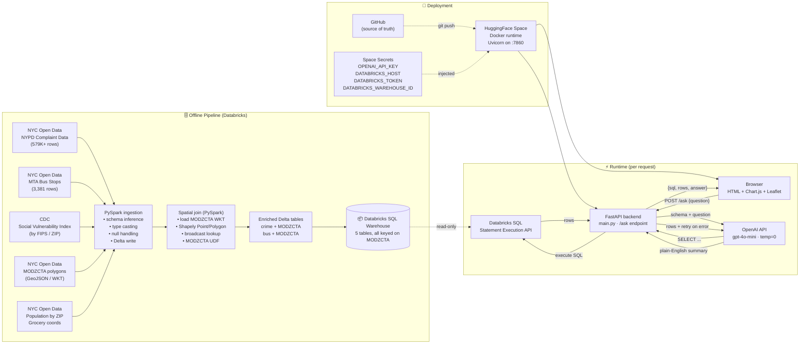
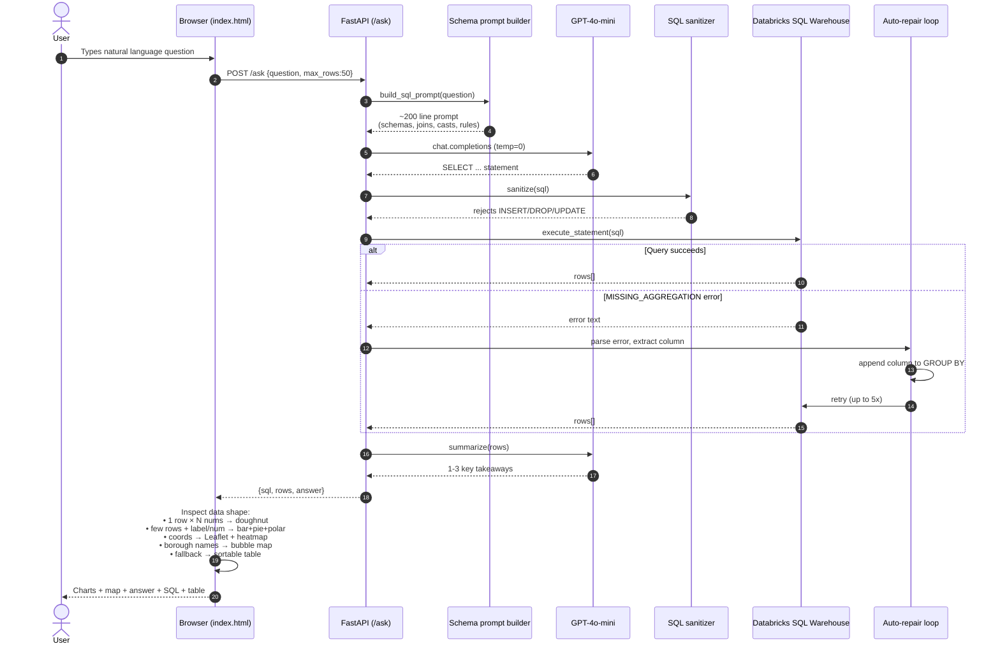
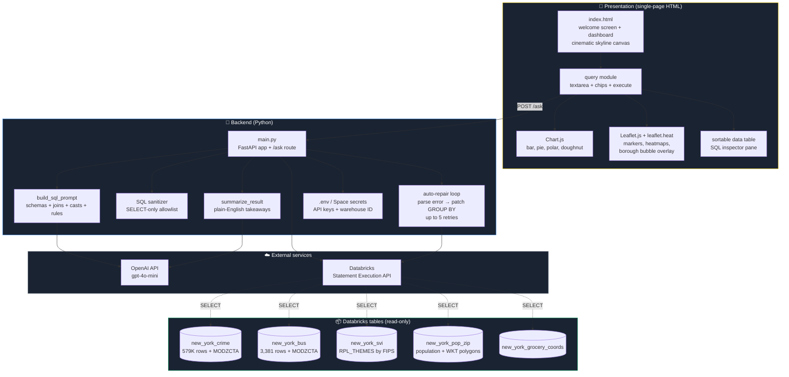

# NYC Intel

**An AI-powered urban intelligence platform over 579K+ NYC open-data records.**
Ask natural-language questions about New York City and get back charts, interactive maps, plain-English summaries, and the SQL that produced them — in seconds.

🔗 **Live demo:** [huggingface.co/spaces/ArchitBhujang/nyc_intel](https://huggingface.co/spaces/ArchitBhujang/nyc_intel)
📂 **Code:** [github.com/BhujArc24/nyc_intel](https://github.com/BhujArc24/nyc_intel)

---

## Table of Contents

1. [What this project does](#what-this-project-does)
2. [Architecture](#architecture)
3. [Tech stack](#tech-stack)
4. [Project structure](#project-structure)
5. [Step-by-step build](#step-by-step-build)
   - [Phase 1 — Data ingestion](#phase-1--data-ingestion)
   - [Phase 2 — Spatial enrichment](#phase-2--spatial-enrichment)
   - [Phase 3 — Schema prompt and SQL generation](#phase-3--schema-prompt-and-sql-generation)
   - [Phase 4 — Auto-repair loop and sanitizer](#phase-4--auto-repair-loop-and-sanitizer)
   - [Phase 5 — Frontend and visual rendering](#phase-5--frontend-and-visual-rendering)
   - [Phase 6 — Deployment](#phase-6--deployment)
6. [Running locally](#running-locally)
7. [What I'd do differently](#what-id-do-differently)
8. [Datasets and credits](#datasets-and-credits)
9. [License](#license)
10. [Contact](#contact)

---

## What this project does

A natural-language interface to New York City's open data with four core capabilities:

- **English-to-SQL question answering.** Ask a plain-English question. GPT-4o-mini translates it into a Databricks SQL query, runs it against five linked NYC datasets, and returns the result with a plain-English summary.
- **Cross-domain joins.** Crime, social vulnerability, transit, grocery access, and population are all linked by ZIP code, so questions like *"which vulnerable neighborhoods have the worst transit access?"* are answerable in one query.
- **Automatic visualization.** The frontend inspects the result shape and chooses the right visual — bar/pie/polar charts for categoricals, Leaflet maps with heatmaps for coordinate data, bubble overlays for borough comparisons, sortable tables for everything else.
- **Self-healing SQL.** When GPT generates a query that fails with a `MISSING_AGGREGATION` error (its single most common mistake), the backend parses the error, patches the `GROUP BY` clause, and retries — up to 5 times.

Plus a cinematic landing page with an animated NYC skyline canvas, scroll-revealed dataset showcase, and a working query interface with click-through chips for common questions.

---

## Architecture

The system has three runtime planes — an offline data pipeline that runs once in Databricks (ingestion + spatial enrichment), a request-time pipeline triggered every time a user asks a question, and a presentation layer rendered in the browser. Below is the full component-level breakdown with the actual flow paths.

### High-level system



### Request lifecycle



### Component map



---

## Tech stack

| Layer | Tools |
|------|------|
| Data warehouse | Databricks SQL Warehouse (serverless), Delta Lake |
| Data pipeline | PySpark, Shapely, broadcast joins |
| Backend framework | FastAPI, Uvicorn, Python 3.11 |
| LLM | OpenAI GPT-4o-mini (SQL generation + summarization) |
| Frontend | Vanilla HTML / CSS / JavaScript (single file, no build step) |
| Charts | Chart.js (bar, pie, polar, doughnut) |
| Maps | Leaflet.js + leaflet.heat |
| Typography | Playfair Display, Outfit, DM Sans, JetBrains Mono |
| Deployment | Docker on HuggingFace Spaces |
| Version control | Git, GitHub, HuggingFace git mirror |

---

## Project structure

```
nyc_intel/
├── main.py                  # FastAPI app, /ask route, schema prompt,
│                            # auto-repair loop, SQL sanitizer
├── index.html               # Single-page UI — landing + dashboard,
│                            # Chart.js + Leaflet + skyline canvas
├── add_zip_codes.sql        # One-time spatial enrichment notebook
│                            # (run in Databricks, not at runtime)
├── Dockerfile               # HuggingFace Space build config
├── requirements.txt         # FastAPI, openai, databricks-sql-connector,
│                            # python-dotenv, uvicorn
├── .env                     # Local secrets (gitignored)
├── .gitignore
└── README.md                # This file
```

---

## Step-by-step build

What follows is the actual process, in order. If you want to reproduce or adapt it, this is the playbook.

### Phase 1 — Data ingestion

Five datasets from three sources, all loaded into Databricks as Delta tables:

1. **NYPD Complaint Data** — ~579K rows from NYC Open Data. Each row is a single crime complaint with offense type, severity (`LAW_CAT_CD`), borough, precinct, demographics, and lat/lng coordinates.
2. **MTA Bus Stops** — 3,381 stops with shelter info, FEMA flood zones, and hurricane evacuation data.
3. **CDC Social Vulnerability Index** — vulnerability scores (`RPL_THEMES`) at the FIPS/ZIP level, including poverty, unemployment, housing burden, and language barriers.
4. **MODZCTA polygons** — Modified ZIP Code Tabulation Area boundaries as WKT geometry, used to reverse-geocode lat/lng to ZIP.
5. **Population by ZIP + grocery store coordinates** — for per-capita rates and food-access analysis.

PySpark notebooks read each source, infer schemas, cast types (NYC Open Data ships everything as strings), and write Delta tables to the workspace catalog.

**Why Databricks?** Originally I tried loading the crime CSV into pandas locally — 579K rows × 35 columns blew through 4 GB of RAM. Databricks Serverless handles it without thinking, and the SQL Warehouse gives me a queryable endpoint without provisioning anything.

### Phase 2 — Spatial enrichment

The crime and bus-stop tables ship with lat/lng but no ZIP code, which means they can't be joined with the SVI or population tables out of the box. The fix is a one-time spatial enrichment job:

```python
from pyspark.sql import functions as F
from shapely.geometry import Point
from shapely import wkt

# Load ZIP polygon boundaries
zip_df = spark.table("new_york_pop_zip").select("MODZCTA", "the_geom").collect()
zip_polys = [(row["MODZCTA"], wkt.loads(row["the_geom"])) for row in zip_df]

# Broadcast the lookup so it runs locally on each executor
zip_polys_bc = spark.sparkContext.broadcast(zip_polys)

def find_zip(lat, lng):
    if lat is None or lng is None:
        return None
    pt = Point(lng, lat)
    for modzcta, poly in zip_polys_bc.value:
        if poly.contains(pt):
            return modzcta
    return None

find_zip_udf = F.udf(find_zip)

crime_enriched = (spark.table("new_york_crime")
    .withColumn("MODZCTA", find_zip_udf(F.col("Latitude"), F.col("Longitude"))))
crime_enriched.write.mode("overwrite").saveAsTable("new_york_crime_enriched")
```

After this runs once, every crime record carries a `MODZCTA` column, and any cross-dataset join becomes a simple equi-join on ZIP.

**Why broadcast and not a spatial index?** At ~180 ZIP polygons, the broadcast lookup runs in microseconds per row. A spatial index (R-tree, geohash) would be necessary at city or state scale, but for NYC it's overkill.

**Why offline and not at query time?** Spatial joins inside every user query would push latency over 10 seconds. Doing the join once and caching the result keeps runtime queries at 1-2s.

### Phase 3 — Schema prompt and SQL generation

The single most important file in the project is the schema prompt — a ~200-line system prompt sent to GPT-4o-mini on every request. It contains:

- The complete schema of all 5 tables (column names, types, sample values).
- The join keys (`MODZCTA` ↔ `FIPS`) and which tables connect to which.
- Casting rules for messy columns (e.g. `pop_est` is stored as a comma-stringified number — every query that uses it needs `TRY_CAST(REPLACE(pop_est, ',', '') AS DOUBLE)`).
- Rules about output: exactly one `SELECT` statement, no `INSERT`/`DROP`/`UPDATE`, no markdown fences.
- A handful of in-context examples covering the most common question patterns (top-N, per-capita, geographic).

```python
def build_sql_prompt(question: str) -> str:
    return f"""You are a SQL generator. Produce exactly one SQL SELECT statement.

=== TABLE SCHEMAS ===
1. new_york_crime (enriched with MODZCTA via spatial join)
   Key columns: BORO_NM, CMPLNT_FR_DT, KY_CD, LAW_CAT_CD, OFNS_DESC,
                Latitude, Longitude, MODZCTA, ...

2. new_york_svi
   Key columns: FIPS (joins to MODZCTA), RPL_THEMES, ...

[...full schema for all 5 tables...]

=== JOIN RULES ===
- crime.MODZCTA = svi.FIPS
- bus.MODZCTA = pop_zip.MODZCTA
- pop_est is comma-stringified — always TRY_CAST(REPLACE(...))

USER QUESTION: {question}
"""
```

The model is called with `temperature=0` for determinism. One model, one prompt, one SQL statement out — no agentic planning loop.

**Why a single prompt and not a multi-stage agent?** A planner-executor pipeline was considered and rejected. At this dataset size, a well-engineered schema prompt outperforms it on both accuracy and latency. The prompt itself is the artifact — every join rule, every casting quirk, every output constraint lives there in one place.

### Phase 4 — Auto-repair loop and sanitizer

GPT's most common failure mode on this prompt is forgetting to add a non-aggregated column to `GROUP BY` — Databricks throws `MISSING_AGGREGATION` and the query fails. Rather than adding more verbose rules to the prompt (which made other things worse), the backend handles it programmatically:

```python
for attempt in range(5):
    try:
        rows = run_databricks_sql(sql)
        break
    except DatabricksError as e:
        if "MISSING_AGGREGATION" in str(e):
            col = parse_missing_column(str(e))
            sql = patch_group_by(sql, col)
            continue
        raise
```

This resolves ~90% of the remaining failures without another model call.

The SQL sanitizer is the second layer of defense:

```python
FORBIDDEN = {"INSERT", "UPDATE", "DELETE", "DROP", "ALTER",
             "CREATE", "TRUNCATE", "GRANT", "REVOKE"}

def sanitize(sql: str):
    upper = sql.upper()
    for kw in FORBIDDEN:
        if re.search(rf"\b{kw}\b", upper):
            raise HTTPException(400, f"Forbidden keyword: {kw}")
```

Combined with a read-only Databricks token, the warehouse is safe even if a prompt injection slipped past the model.

### Phase 5 — Frontend and visual rendering

The entire UI is a single `index.html` — no React, no build step, no `node_modules`. Three reasons:

1. **Loads instantly on a free CPU container** (no hydration, no bundle download).
2. **Trivial to deploy** — copy the file, done.
3. **Recruiters can read the source.** `view source` on a Next.js app shows them gibberish; on this one they see the architecture.

The page has two views in one file:

- **Welcome screen** — full-viewport cinematic landing with a particle canvas (90 nodes + golden connection lines), an SVG NYC skyline silhouette with gold gradient, and scroll-triggered fade-in for the dataset showcase, capabilities bento grid, and tech-stack section.
- **Dashboard** — query textarea, suggestion chips, and a results region that renders different visuals based on the data shape:

```javascript
function renderResults(rows) {
  if (rows.length === 1 && hasMultipleNumericCols(rows[0])) {
    renderDoughnut(rows);
  } else if (rows.length <= 8 && hasLabelAndNumber(rows)) {
    renderBar(rows);
    renderPie(rows);
    renderPolar(rows);
  } else if (hasCoordinates(rows)) {
    renderLeafletMap(rows);
    renderHeatmap(rows);
  } else if (hasBoroughNames(rows)) {
    renderBoroughBubbleMap(rows);
  } else {
    renderSortableTable(rows);
  }
}
```

This shape inspection is deterministic, free, and instant — no second roundtrip to the LLM to ask "what chart should I use?"

### Phase 6 — Deployment

Two remotes, one source of truth:

- **GitHub** (`github.com/BhujArc24/nyc_intel`) — main, public, where commits land first.
- **HuggingFace Space** (`huggingface.co/spaces/ArchitBhujang/nyc_intel`) — Docker runtime that automatically rebuilds on push.

The `Dockerfile` is minimal:

```dockerfile
FROM python:3.11-slim
WORKDIR /app
COPY requirements.txt .
RUN pip install --no-cache-dir -r requirements.txt
COPY . .
EXPOSE 7860
CMD ["uvicorn", "main:app", "--host", "0.0.0.0", "--port", "7860"]
```

Secrets (`OPENAI_API_KEY`, `DATABRICKS_HOST`, `DATABRICKS_TOKEN`, `DATABRICKS_WAREHOUSE_ID`) are stored as HF Space secrets and injected as environment variables at runtime — never committed.

Cold-start tradeoff: Databricks Serverless takes ~10-15 seconds to wake up on the first query of a session. Subsequent queries are 1-2s. Acceptable for a portfolio demo; if this were production I'd run a small keep-alive cron.

---

## Running locally

```bash
# 1. Clone
git clone https://github.com/BhujArc24/nyc_intel.git
cd nyc_intel

# 2. Create virtual environment
python -m venv venv
source venv/bin/activate    # Windows: venv\Scripts\activate

# 3. Install dependencies
pip install -r requirements.txt

# 4. Set your secrets
cat > .env <<EOF
OPENAI_API_KEY=sk-...
DATABRICKS_HOST=adb-xxxxx.azuredatabricks.net
DATABRICKS_TOKEN=dapi-...
DATABRICKS_WAREHOUSE_ID=abc123def456
EOF

# 5. Run
uvicorn main:app --reload
```

Then open `http://127.0.0.1:8000/`. First query takes ~10s while the Databricks warehouse cold-starts; subsequent queries are 1-2s.

You'll need your own Databricks workspace with the five NYC tables loaded. The ingestion + spatial enrichment notebooks (`add_zip_codes.sql` and the PySpark equivalent) are included in the repo.

---

## What I'd do differently

Being honest — if I were rebuilding this:

- **Stream the response.** Right now the user waits 2-4 seconds staring at a spinner while the query runs and the summary generates. Streaming the SQL token-by-token (so they see the model thinking) and the rows progressively as they arrive would feel dramatically faster, even if total latency is the same.
- **Multi-stage agent for ambiguous questions.** The single-prompt approach works well when the question maps cleanly to one query. For ambiguous questions like *"what should the city focus on?"*, a planner that breaks the question into sub-queries, runs each, and synthesizes the result would be more robust. The cost is latency.
- **Persist successful queries as in-context examples.** Right now every request starts from a static prompt. If I stored the last 50 successful (question, SQL) pairs and injected the most semantically similar 3-5 as few-shot examples, accuracy would go up over time without any model fine-tuning.
- **Add a query cache.** Identical questions re-run the full pipeline — model call, SQL execution, summarization. A simple LRU cache on the question string would make repeat visits instant and cut OpenAI + Databricks costs.
- **Embed the schema, don't paste it.** The schema prompt is ~200 lines and grows linearly with every table I add. Embedding each table's schema and retrieving only the relevant ones per question would scale better and cost less per token.
- **Replace the single `index.html` with a proper component framework once it grows.** Vanilla JS is correct for a 2,000-line single-page app. At ~5,000 lines it stops being correct. I'd reach for SolidJS or Svelte, not React.

---

## Datasets and credits

- **NYPD Complaint Data Historic** — NYC Open Data
  [data.cityofnewyork.us](https://data.cityofnewyork.us/Public-Safety/NYPD-Complaint-Data-Historic/qgea-i56i)
- **MTA Bus Stops** — NYC Open Data / MTA
- **CDC Social Vulnerability Index** — Centers for Disease Control and Prevention
  [atsdr.cdc.gov/placeandhealth/svi](https://www.atsdr.cdc.gov/placeandhealth/svi/index.html)
- **Modified ZIP Code Tabulation Areas (MODZCTA)** — NYC Department of Health
- **NYC Population by ZIP** — US Census via NYC Open Data
- **Grocery store locations** — NYC Open Data

All datasets are publicly licensed for non-commercial use.

---

## License

MIT — feel free to use the code, architecture, or approach for your own projects.

---

## Contact

**Archit Bhujang** · Computer Systems Engineering (Cybersecurity) @ Arizona State University

- 🔗 LinkedIn: [archit-bhujang](https://www.linkedin.com/in/archit-bhujang-840b63217/)
- 💻 GitHub: [BhujArc24](https://github.com/BhujArc24)
- ✉️ Email: [bhujang.archit@gmail.com](mailto:bhujang.archit@gmail.com)

If this helped or you're building something similar, I'd love to hear about it.